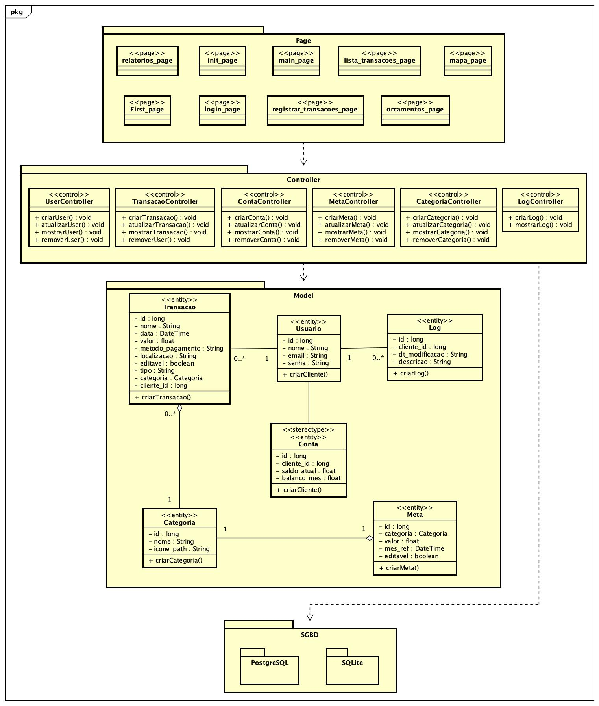
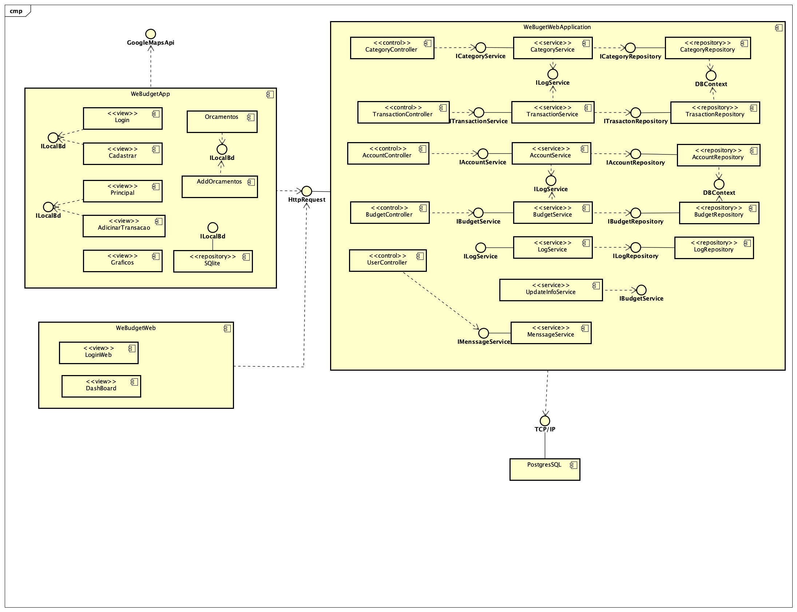

# WeBudget

**Helen Camila de Oliveira Andrade, hcoandrade@sga.pucminas.br**

**Izabella de Castro Lucas, iclucas@sga.pucminas.br**

**Nataniel Geraldo Mendes Peixoto, nataniel.peixoto@sga.pucminas.br**

**Pedro Campos Miranda, pcmiranda@sga.pucminas.br**

**Pedro Henrique Gonçalves Barcelos, 1265406@sga.pucminas.br**

---

Professores:

**Cleiton Silva Tavares**

**José Laerte Pires Xavier Junior**

---

_Curso de Engenharia de Software, Unidade Praça da Liberdade_

_Instituto de Informática e Ciências Exatas – Pontifícia Universidade de Minas Gerais (PUC MINAS), Belo Horizonte – MG – Brasil_

---

_**Resumo**. Escrever aqui o resumo. O resumo deve contextualizar rapidamente o trabalho, descrever seu objetivo e, ao final, 
mostrar algum resultado relevante do trabalho (até 10 linhas)._

---

## Histórico de Revisões

| **Data** | **Autor** | **Descrição** | **Versão** |
| --- | --- | --- | --- |
| **[31/08/2022]** | [Helen] | [Estruturação inicial da Apresentação e Requisitos do projeto] | [1.0.0] |
| **[14/09/2022]** | [Helen] | [Correções da Apresentação e Requisitos do projeto] | [1.0.1] |
| **[17/09/2022]** | [Izabella] | [Estruturação inicial da modelagem e projeto arquitetural] | [1.0.2] |
| **[17/09/2022]** | [Nataniel] | [Estrutura inicial de código mobile da aplicação] | [1.0.3] |
| **[17/09/2022]** | [Izabella] | [Criação dos protótipos de tela da aplicação] | [1.0.4] |
| **[18/09/2022]** | [Nataniel] | [Implementação login] | [1.0.5] |
| **[21/09/2022]** | [Pedro Campos] | [Estrutura inicial do código backend da aplicação] | [1.0.6] |
| **[21/09/2022]** | [Izabella] | [Estrutura inicial do código web da aplicação] | [1.0.7] |
| **[27/09/2022]** | [Nataniel] | [Criação de novas telas e barra de navegação] | [1.0.8] |
| **[03/10/2022]** | [Izabella] | [Implementação tela de cadastro de transações e metas] | [1.0.9] |
| **[09/10/2022]** | [Pedro Campos] | [Implementação da tela de mapas] | [1.1.0] |
| **[09/10/2022]** | [Izabella] | [Criação conexão banco de dados SQFLite na aplicação mobile] | [1.1.1] |
| **[09/10/2022]** | [Izabella] | [Implementação lista de transações aplicação mobile] | [1.1.2] |
| **[11/10/2022]** | [Nataniel] | [Implementação cadastro de categoria] | [1.1.3] |
| **[22/10/2022]** | [Pedro Campos] | [Criação de novos controllers no código backend] | [1.1.4] |
| **[25/10/2022]** | [Pedro Campos] | [Configuração CORS no código backend] | [1.1.5] |
| **[08/11/2022]** | [Izabella] | [Revisão layout da aplicação mobile] | [1.1.6] |
| **[08/11/2022]** | [Pedro Campos] | [Implementação backend lógica de autenticação e token] | [1.1.7] |
| **[09/11/2022]** | [Nataniel] | [Implementação mensageria na aplicação mobile] | [1.1.8] |
| **[09/11/2022]** | [Pedro Henrique] | [Criação gráficos aplicação mobile] | [1.1.9] |
| **[12/11/2022]** | [Pedro Campos] | [Implementaçaõ mensageria no código backend] | [1.2.0] |
| **[13/11/2022]** | [Izabella] | [Criação de filtros nas telas da aplicação mobile] | [1.2.1] |
| **[14/11/2022]** | [Nataniel] | [Implementação código na versão mobile de conexão ao banco de dados remoto] | [1.2.2] |
| **[15/11/2022]** | [Nataniel e Pedro Campos] | [Hospedagem API no Azure] | [1.2.3] |
| **[17/11/2022]** | [Nataniel] | [Sincronização entre mensageria e aplicação mobile] | [1.2.4] |
| **[20/11/2022]** | [Nataniel] | [Implementação apuração de saldos na tela principal da aplicação mobile] | [1.2.5] |
| **[21/11/2022]** | [Pedro Campos] | [Implementação lógica de recuperação de senha na versão web] | [1.2.6] |
| **[22/11/2022]** | [Helen] | [Criação gráficos na aplicação web] | [1.2.7] |
| **[27/11/2022]** | [Pedro Campos] | [Criação de testes do código backend] | [1.2.8] |
| **[30/11/2022]** | [Nataniel] | [Implementação lógica de edição dados usuário na aplicação mobile] | [1.2.9] |
| **[01/12/2022]** | [Pedro Henrique] | [Criação de testes do código flutter (versão mobile)] | [1.3.0] |
| **[03/12/2022]** | [Pedro Campos] | [Implementação de lógica no backend de envio de email de recuperação de senha] | [1.3.1] |
| **[08/12/2022]** | [Helen] | [Correções gráficos aplicação web] | [1.3.2] |
| **[11/12/2022]** | [Nataniel] | [Implementação de recuperação de dados na nuvem após login na aplicação mobile] | [1.3.3] |
| **[13/12/2022]** | [Nataniel] | [Avaliação arquitetura pelo método ATAM] | [1.3.4] |
| **[13/12/2022]** | [Helen] | [Ajustes gerais na aplicação web] | [1.3.5] |
| **[14/12/2022]** | [Izabella] | [Implementação de tutorial da aplicação na versão mobile] | [1.3.6] |

## SUMÁRIO

1. [Apresentação](#apresentacao "Apresentação")  
	1.1. Problema  
	1.2. Objetivos do trabalho  
	1.3. Definições e Abreviaturas  

2. [Requisitos](#requisitos "Requisitos")  
	2.1. Requisitos Funcionais  
	2.2. Requisitos Não-Funcionais  
	2.3. Restrições Arquiteturais  
	2.4. Mecanismos Arquiteturais  

3. [Modelagem](#modelagem "Modelagem e projeto arquitetural")  
	3.1. Visão de Negócio  
	3.2. Visão Lógica  
	3.3. Modelo de dados (opcional)  

4. [Avaliação](#avaliacao "Avaliação da Arquitetura")  
	4.1. Cenários  
	4.2. Avaliação  

5. [Referências](#referencias "REFERÊNCIAS") 

6. [Apêndices](#apendices "APÊNDICES") 

# 1. Apresentação

Muitas vezes a tarefa de coordenar as finanças pessoais é deixada de lado no Brasil, entre os motivos de problemas financeiros e até psicológicos, o descontrole financeiro é mais comum que parece.

De acordo com pesquisas realizadas pelo SPC Brasil e pela Confederação Nacional de Dirigentes Lojistas (CNDL), "seis em cada 10 brasileiros (58%) admitem nunca, ou somente as vezes, dedicam a atividades de controle da vida financeira".(SOUZA, 2018)

Esse controle financeiro é essencial para ter uma qualidade de vida. E com o mundo cada vez mais tecnológico, o smartphone se torna um elemento imprescindível nessa busca.

A consulta de gastos, receitas e uma possível elaboração de um plano financeiro é restrito apenas ao extrato bancário, se tornando complexa e desorganizada. Diante desse contexto surge a necessidade de amparo que possam auxiliar de maneira prática as pessoas que buscam realizar o controle de suas próprias finanças.

## 1.1. Problema

Notícias que demonstram o descontrole financeiro presente na maior parte da população brasileira estão cada vez mais comuns, segundo o Mapa da Inadimplência da Serasa, "em junho de 2022 haviam mais de 68 milhões de pessoas endividadas no Brasil"(Serasa,2022). Esse endividamento traz vários problemas, não apenas financeiros, como também de qualidade de vida.

## 1.2. Objetivos do trabalho

Utilizando de conhecimentos adquiridos nas disciplinas do curso de Engenharia de Software, tais como levantamentos de requisitos e programação, foi proposto o desenvolvimento de uma solução para o auxílio no controle, organização e planejamento financeiro. O objetivo geral é desenvolver um aplicativo que auxilie o usuário na organização da sua vida financeira.

Os objetivos específicos do projeto são:

- Auxiliar o usuário no controle de metas de despesas, receitas e investimentos;
- Possibilitar o usuário a gestão de objetivos financeiros de curto, médio e longo prazo;
- Possibilitar o usuário salvar o local das compras realizadas com a utilização do GPS.

## 1.3. Definições e Abreviaturas

- ID: Identidade;
- API: Application Programming Interface (Interface de Programação de Aplicação);
- SPC: Serviço de Proteção ao Crédito;
- RF: Requisito Funcional;
- RNF: Requisito Não Funcional;
- HTML: Hypertext Markup Language;
- CSS: Cascading Style Sheet (Folha de Estilo em Cascatas);
- JS: Java Script.

# 2. Requisitos

Visando auxiliar a definir quais são as funcionalidades de maior prioridade de serem feitas antes e quais possuem um maior nível de complexidade de se desenvolver foram desenvolvidas as tabelas abaixo.

## 2.1. Requisitos Funcionais

| **ID** | **Descrição** | **Prioridade** |
| --- | --- | --- |
| RF001 | O usuário realiza login no sistema com email e senha. | Alta |
| RF002 | O usuário se cadastra no sistema, informando os dados de nome, email, senha e confirmação de senha. | Alta |
| RF003 | O usuário poderá alterar o cadastro do seu email e senha. | Média |
| RF004 | O usuário deverá visualizar no primeiro login do sistema as informações explicando as funcionalidades da aplicação. | Média |
| RF005 | O usuário será capaz de recuperar a senha utilizando o email. | Média |
| RF006 | O usuário visualiza uma página inicial com o total de receitas, despesas, saldo atual, situação financeira bem como as últimas transações. | Alta |
| RF007 | O usuário visualiza uma página com a relação de todas as movimentações financeiras de determinado mês selecionado. | Alta |
| RF008 | O usuário cadastra categorias de despesa informando nome e selecionando ícones previamente cadastrados | Alta |
| RF009 | O usuário cadastra metas mensais de orçamento informando categoria e valor. | Alta |
| RF010 | O usuário visualiza as metas cadastradas dos meses anteriores. | Alta |
| RF011 | O usuário será capaz de excluir e editar metas do mês vigente. | Alta |
| RF012 | O usuário cadastra transações financeiras informando categoria, nome, data, valor, forma de pagamento e localização. | Alta |
| RF013 | O usuário será capaz de editar e excluir as transações financeiras do mês corrente. | Alta |
| RF014 | O usuário pode informar o local da compra utilizando o GPS. | Alta |
| RF015 | O usuário visualiza um gráfico de rosca com as despesas separadas por categoria do mês selecionado. | Alta |
| RF016 | O usuário visualiza um gráfico de rosca com as receitas separadas por categoria do mês selecionado. | Alta |
| RF017 | O usuário visualiza um gráfico de linha com a evolução dos receitas do mês selecionado. | Alta |
| RF018 | O usuário visualiza um gráfico de barra com a evolução dos despesas do mês selecionado. | Alta |
| RF019 | O usuário visualiza uma tabela no aplicativo web com a relação das transações realizadas no mês. | Alta |

## 2.2. Requisitos Não-Funcionais

| **ID** | **Descrição** |
| --- | --- |
| RNF001 | O software deve ser compatível nas plataformas Android. |
| RNF002 | O sistema deve prover serviços no ambiente web e móvel. |
| RNF003 | O usuário deve estar autenticado. |
| RNF004 | O sistema deve responder as requisições em até 2 segundos. |
| RNF005 | O sistema deve ser aprovado em testes unitários. |
| RNF006 | A parte mobile deve ter persistencia de dados local. |
| RNF007 | O sistema deve estar disponível 98% do tempo. |

## 2.3. Restrições Arquiteturais

As restrições impostas ao projeto que afetam sua arquitetura são :

- O Front-end da versão web será desenvolvido em HTML, CSS e JS;
- O Front-end da versão mobile será desenvolvido em Flutter;
- Os requisitos do Back-end serão desenvolvidos em C#- Microsoft .Net Core;
- Para a persistência de dados deve ser utilizado o SQL Server;
- Será utilizada a Api do google Maps.

## 2.4. Mecanismos Arquiteturais

| **Análise** | **Design** | **Implementação** |
| --- | --- | --- |
| Persistência Web | Banco de dados relacional | SQL server |
| Persistência Mobile | Banco de dados relacional | SQLite |
| Apresentação | Front-end web | HTML, CSS e JS |
| Apresentação | Front-end mobile | Flutter |
| Negócio | Back-end | C# |
| Teste de Software | Framework | XUnit |
| Deploy | API | Azure |
| Integração | Rest | Netlify |

# 3. Modelagem e projeto arquitetural

**Figura 1 - Visão Geral da arquitetura de solução.**

No momento em que é realizado o acesso ao sistema, o cliente mobile irá receber a interface renderizada pelo Flutter e as informações armazenadas diretamente no SQLite através de uma requisição HTTP. Em contrapartida, o cliente web receberá a interface disponibilizada pelo HTML,CSS e JS por meio de uma requisição TCP/IP. 

A comunicação com o back-end é por meio de uma api RESTful programada em C#, testada por meio do framework XUnit.net e suas APIs armazenadas no Azure. Através do C#, a aplicação web realiza a conexão ao banco de dados SQL Server por meio do ORM. Todo o ambiente virtual será disponibilizado por meio do Azure.

## 3.1. Visão de Negócio (Funcionalidades)

1.O sistema deve possibilitar o login do usuário na aplicativo

2.O sistema deve possibilitar o cadastro do usuário na plataforma.

3.O sistema deve possibilitar ao usuário inserir suas receitas e despesas do mês.

4.O sistema deve possibilitar a visualização do balanço entre receita e despesas.

5.O sistema deve possibilitar o usuário navegar pelos meses antecessores e futuros para estar visualizando as informações da receita, despesas e balanço.

6.O sistema deve possibilitar ao usuário visualizar relatórios e gráficos da movimentação financeira mensal.

7.O sistema deve possibilitar o usuário a inserir e visualizar a localização da compra no mapa.

8.O sistema deve possibilitar ao usuário escolher a forma que a despesa foi feita (a vista, débito, crédito ou parcelado).

9.O sistema deve possibilitar ao usuário cadastrar metas de despesas (alimentação, vestuário, viagem, lazer,.....).

10.O sistema deve possibilitar ao usuário receber notificações de limite de despesa excedido.

11.O sistema deve possibilitar o usuário cadastrar investimentos realizados e metas (investimento em tesouro direto, meta para compra de um carro,...).

12.O sistema deve possibilitar a exclusão da conta caso o usuário deseje.

### Descrição resumida dos Casos de Uso / Histórias de Usuário

Casos de Uso:

#### UC01 –  Acessar o aplicativo

| **Descrição** | Eu como usuário quero realizar o cadastro e o login no aplicativo |
| --- | --- |
| **Atores** | Usuário |
| **Prioridade** | Alta |
| **Requisitos associados** | RF001 e RF002 |
| **Fluxo Principal** |Entrar no aplicativo, realizar cadastro e realizar login. |

#### UC02 – Acessar as minhas receitas, despesas e transações

| **Descrição** | Eu como usuário quero poder estar visualizando a minha receita, despesas e transações cadastradas recentemente |
| --- | --- |
| **Atores** | Usuário |
| **Prioridade** | Alta |
| **Requisitos associados** | RF004|
| **Fluxo Principal** | Entrar no aplicativo e acessar o menu|

#### UC03 – Editar cadastro

| **Descrição** | Eu como usuário quero poder editar o meu cadastro |
| --- | --- |
| **Atores** | Usuário |
| **Prioridade** | Média |
| **Requisitos associados** | RF003 |
| **Fluxo Principal** | Entrar no aplicativo, ir nas configurações e editar cadastro|

#### UC04 – Acessar todas as transações 

| **Descrição** | Eu como usuário quero poder visualizar todas as transações do mês|
| --- | --- |
| **Atores** | Usuário |
| **Prioridade** | Alta |
| **Requisitos associados** | RF005 |
| **Fluxo Principal** | Entrar no aplicativo e acessar transações|

#### UC05 – Cadastrar metas

| **Descrição** | Eu como usuário quero poder cadastrar metas de despesa por tipo|
| --- | --- |
| **Atores** | Usuário |
| **Prioridade** | Alta |
| **Requisitos associados** | RF006 |
| **Fluxo Principal** | Entrar no aplicativo, cadastrar conteúdo e inserir meta|

#### UC06 – Cadastrar despesas e receitas

| **Descrição** | Eu como usuário quero cadastrar minhas receitas e despesas|
| --- | --- |
| **Atores** | Usuário |
| **Prioridade** | Alta |
| **Requisitos associados** | RF007 e RF009 |
| **Fluxo Principal** | Entrar no aplicativo, cadastrar conteúdo e inserir despesas ou receitas|

#### UC07 – Acessar relatório

| **Descrição** | Eu como usuário quero acessar relatórios |
| --- | --- |
| **Atores** | Usuário |
| **Prioridade** | Média |
| **Requisitos associados** | RF010 e  RF012 |
| **Fluxo Principal** | Entrar no aplicativo e acessar os relatórios|

#### UC08 – Recebimento de notificação

| **Descrição** | Eu como usuário quero receber notificação quando bater o meu limite de despesa|
| --- | --- |
| **Atores** | Usuário |
| **Prioridade** | Média|
| **Requisitos associados** | RF011 |
| **Fluxo Principal** | Entrar no aplicativo, entrar em configurações e  habilitar o recebimento de notificações|

#### UC09 – Inserir localização de compra

| **Descrição** | Eu como usuário desejo poder inserir juntamente com o meu gasto a localização da despesa|
| --- | --- |
| **Atores** | Usuário |
| **Prioridade** |Alta|
| **Requisitos associados** | RF008 |
| **Fluxo Principal** | Entrar no aplicativo, cadastrar conteúdo, entrar em despesas ou receitas, selecionar opção despesa e inserir localização|

 Histórias de Usuário:

- Como pai de família quero conseguir cadastrar metas financeiras, para que eu possa estar comprando um carro futuramente.
- Como estagiário, quero poder analisar como está o fluxo de meu dinheiro, para que eu possa ter mais controle dos meus gastos.
- Como dona de uma loja de bolos, desejo saber a localização dos comércios em que comprei os produtos para fabricação dos bolos, a fim de que ao realizar o fechamento  das contas do mês eu consiga identificar mais rapidamente quais foram os gastos.
- Como noivo, precisa fazer um planejamento financeiro, para que consiga pagar o casório.

## 3.2. Visão Lógica

### Diagrama de Classes

### Diagrama de componentes

# 4. Avaliação da Arquitetura

_Esta seção descreve a avaliação da arquitetura apresentada, baseada no método ATAM._

## 4.1. Cenários

**Cenário 1 - Capacidade para ser Instalado:** A aplicação mobile deve ser desenvolvida de modo a ser compatível com a plataforma Android. - RNF001

**Cenário 2 - Interoperabilidade:** O software deve prover funcionalidades nas aplicações mobile e web. Na versão mobile, o usuário cadastra as transações financeiras, metas, categorias e visualiza gráficos. Na versão web o usuário visualiza os gráficos com as mesmas informações, bem como uma tabela com todas as transações cadastradas  - RNF002

**Cenário 3 – Segurança:** A aplicação deve garantir a segurança do usuário pela utilização de autenticação. No momento do login, é retornado o token JWT que por sua vez é armazenado no shared preference na versão mobile. Nas requisições HTTP, o token é enviado no header. Uma requisição com token de autenticação deve retornar o status 200, sem o token deve retornar o status 401 (unauthorized) - RNF003

**Cenário 4 – Desempenho:** O sistema deve prover um tempo de resposta adequado ao uso, com resposta de no máximo 2 segundos. - RNF004

**Cenário 5 – Testabilidade:** A aplicação deve ter cobertura de testes de no mínimo 60% para o código mobile e para a API. - RNF005

**Cenário 6 – Recuperabilidade:** O sistema deve replicar as informações do usuário cadastradas no banco de dados remoto para a aplicação local. A sincronização durante o uso da aplicação é garantida pela mensageria. No caso de criação, edição ou exclusão de informações, a API é responsável por enviar os dados para serem salvos no SQL, bem como enviar uma mensagem para o "CloudAMQP - RabbitMQ as a Service", responsável por atualizar o banco local sqflite. - RNF006

**Cenário 7 – Disponibilidade:** O sistema deve estar disponível para interação com o usuário no mínimo 98% do tempo. - RNF007

## 4.2. Avaliação

| **Atributo de Qualidade:** | Capacidade para ser instalado |
| --- | --- |
| **Requisito de Qualidade** | Compatibilidade com a plataforma Android |
| **Preocupação:** | O sistema deve ser instalado corretamente nos dispositivos móveis com sistema operacional Android. |
| **Cenários(s):** | Cenário 1 |
| **Ambiente:** | Sistema operacional Android. |
| **Estímulo:** | Instalação do aplicativo no emulador com sistema operacional Android. |
| **Mecanismo:** | Aplicação deve ser desenvolvida implementando o Material Design, responsável por estilizar os widgets de interface com base nos padrões do Google. |
| **Medida de Resposta:** | No código fonte da aplicação mobile deve constar o "import 'package:flutter/material.dart'". |

**Considerações sobre a arquitetura:**

| **Riscos:** | Não existe |
| --- | --- |
| **Pontos de Sensibilidade:** | Não existe |
| _ **Tradeoff** _ **:** | Não existe |

Evidências do testes:

  

| **Atributo de Qualidade:** | Interoperabilidade |
| --- | --- |
| **Requisito de Qualidade** | Sistem deve prover serviços no ambiente móvel e web. |
| **Preocupação:** | O sistema deve funcionar nos sistemas operacionais Android e nos navegadores chrome, mozila e edge. |
| **Cenários(s):** | Cenário 2 |
| **Ambiente:** | Sistema em operação |
| **Estímulo:** | Login na aplicação por meio de um dispositivo móvel e na web. |
| **Mecanismo:** | Cadastro de uma transação na software instaldao em um dispositivo móvel e visualização da mesma informação na tabela da versão web. |
| **Medida de Resposta:** | A transação cadastrada na aplicação móvel foi visualizada na aplicação web, de acordo com o layout de cada dispositivo, não sendo necessário configurações adicionais. |

**Considerações sobre a arquitetura:**

| **Riscos:** | Não existe |
| --- | --- |
| **Pontos de Sensibilidade:** | Não existe |
| _ **Tradeoff** _ **:** | Não existe |

| **Atributo de Qualidade:** | Segurança |
| --- | --- |
| **Requisito de Qualidade** | A aplicação deve garantir a segurança dos dados do usuário |
| **Preocupação:** | Somente usuários autenticados devem operar o sistema. |
| **Cenários(s):** | Cenário 3 |
| **Ambiente:** | Sistema em operação. |
| **Estímulo:** | Utilização das rotas (endpoints) sem token de autenticação. |
| **Mecanismo:** | Interação com os endpoints do Swagger. |
| **Medida de Resposta:** | Nenhuma requisição que envolva informações sensíveis deve ser realizada sem a autenticação. |

**Considerações sobre a arquitetura:**

| **Riscos:** | Não existe |
| --- | --- |
| **Pontos de Sensibilidade:** | Não existe |
| _ **Tradeoff** _ **:** | Não existe |

Evidências do testes:
*Geração de token no login*

*Operação GET sem autenticação*

*Operação GET com autenticação*

| **Atributo de Qualidade:** | Desempenho |
| --- | --- |
| **Requisito de Qualidade** | A aplicação deve ter um tempo de resposta de no máximo 2s |
| **Preocupação:** | Os usuários devem ter uma boa experiência na utilização da aplicação. |
| **Cenários(s):** | Cenário 4 |
| **Ambiente:** | Sistema em operação com operações básicas. |
| **Estímulo:** | Usuário utilizando a aplicação e com percepção de respostas rápidas. |
| **Mecanismo:** | Consultar o tempo de resposta da API hospedade no "Serviço de Aplicativos" na Azure. |
| **Medida de Resposta:** | Analisar e o tempo médio de resposta das requisições HTTP é superior a 2s. |

**Considerações sobre a arquitetura:**

| **Riscos:** | Não existe |
| --- | --- |
| **Pontos de Sensibilidade:** | Não existe |
| _ **Tradeoff** _ **:** | Não existe |

Evidência de teste:

| **Atributo de Qualidade:** | Testabilidade |
| --- | --- |
| **Requisito de Qualidade** | O backend do sistema deve ser cobertura de testes de no mínimo 60%. |
| **Preocupação:** | Garantia de deploy em produção de um software minimamente testado. |
| **Cenários(s):** | Cenário 5 |
| **Ambiente:** | Microsoft Visual Studio. |
| **Estímulo:** | Executar os testes unitários escritos para testar a robustez da aplicação. |
| **Mecanismo:** | Avaliar se o percentual de testes que passaram foi de no mínimo 60%, por meio da biblioteca xUnit. |
| **Medida de Resposta:** | A biblioteca utilizada deve informar que no mínimo 60% da aplicação foi testada . |

**Considerações sobre a arquitetura:**

| **Riscos:** | Não existe |
| --- | --- |
| **Pontos de Sensibilidade:** | Não existe |
| _ **Tradeoff** _ **:** | Não existe |

Evidência de teste:

*Teste flutter*

*Teste Backend - API*

| **Atributo de Qualidade:** | Recuperabilidade |
| --- | --- |
| **Requisito de Qualidade** | Deve haver consistência dos dados no banco de dados remoto e local. |
| **Preocupação:** | O usuário deve ter acesso a mesma base de dados tanto no ambiente remoto quanto no ambiente virtual. |
| **Cenários(s):** | Cenário 6 |
| **Ambiente:** | Sistema em operação. |
| **Estímulo:** | Usuário deve ter acesso as informações do banco de dados remoto caso desistale a aplicação mobile e posteriormente instale novamente . |
| **Mecanismo:** | Cadastrar uma transação e uma categoria, desistalar a aplicação e instalar novamente. |
| **Medida de Resposta:** | Após reinstalar a aplicação, o usuário deve ter acesso as mesmas informações que tinha antes de desinstalar o software. |

**Considerações sobre a arquitetura:**

| **Riscos:** | Não existe |
| --- | --- |
| **Pontos de Sensibilidade:** | Não existe |
| _ **Tradeoff** _ **:** | Não existe |

Evidência de teste:

| **Atributo de Qualidade:** | Disponibilidade |
| --- | --- |
| **Requisito de Qualidade** | A aplicação deve estar disponível 98% do tempo |
| **Preocupação:** | Deve ser minimizado os efeitos da indisponibilidade do sistema para o usuário. |
| **Cenários(s):** | Cenário 7 |
| **Ambiente:** | Sistema em operação com operações básicas. |
| **Estímulo:** | Usuário utilizando a aplicação com a percepção de que o sitema está disponível quase que em 100% do tempo. |
| **Mecanismo:** | Consultar o tempo de disponibilidade do sistema no "Application Insights" na Azure. |
| **Medida de Resposta:** | O sistema deve estar disponível no mínimo em 98% do tempo. |

**Considerações sobre a arquitetura:**

| **Riscos:** | Não existe |
| --- | --- |
| **Pontos de Sensibilidade:** | Não existe |
| _ **Tradeoff** _ **:** | Não existe |

Evidência de teste:

# 5. REFERÊNCIAS

**[1]** - _SOUZA, Ludmila. **Pesquisa revela que 58% dos brasileiros não se dedicam às próprias finanças**. São Paulo, c2018._

**[2]** - _SERASA. **Mapa da inadimplência e renegociação de dívidas no Brasil**. c2022._

# 6. APÊNDICES

https://github.com/ICEI-PUC-Minas-PPLES-TI/plf-es-2022-2-ti5-5104100-financas-pessoais
